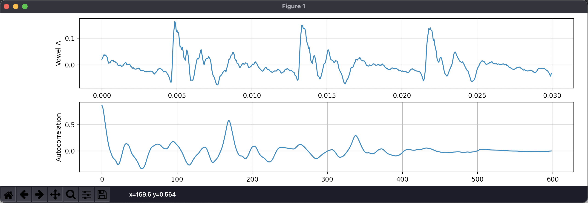
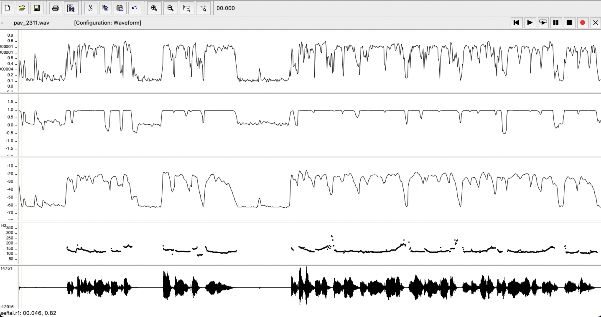
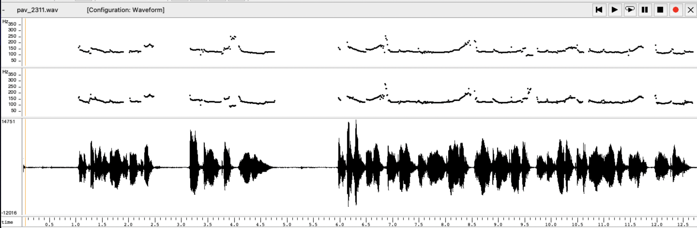
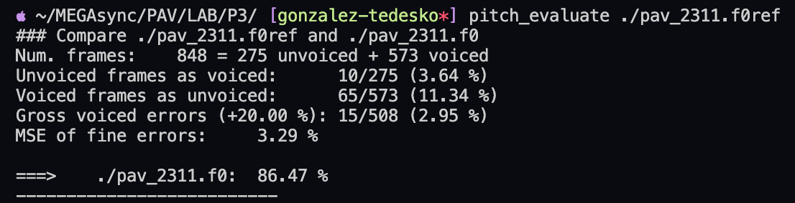
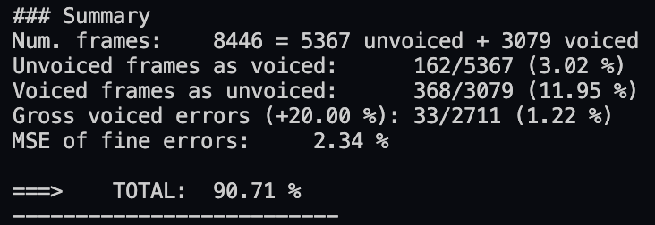
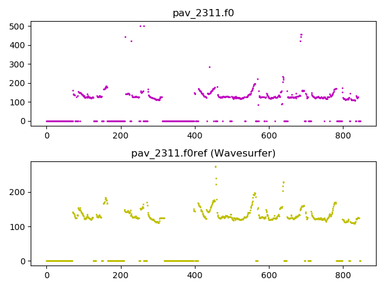
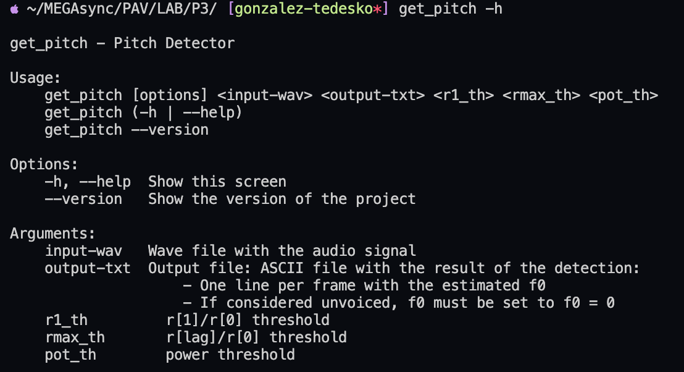

# PAV - P3: detección de pitch


- Complete el código de los ficheros necesarios para realizar la detección de pitch usando el programa
  `get_pitch`.

   * Complete el cálculo de la autocorrelación e inserte a continuación el código correspondiente.

    >``` cpp
    >void PitchAnalyzer::autocorrelation(const vector<float> &x, vector<float> &r) const {
    >
    >   for (unsigned int l = 0; l < r.size(); ++l) {
    >     r[l] = 0;
    >     for (unsigned int j = 0; j < x.size() - l; ++j) {
    >       r[l] += x[j]*x[j+l];
    >     }
    >     r[l] /= x.size();
    >   }
    >
    >   if (r[0] == 0.0F) //to avoid log() and divide zero 
    >     r[0] = 1e-10; 
    >}
    >```

   * Inserte una gŕafica donde, en un *subplot*, se vea con claridad la señal temporal de un segmento de
     unos 30 ms de un fonema sonoro y su periodo de pitch; y, en otro *subplot*, se vea con claridad la
	 autocorrelación de la señal y la posición del primer máximo secundario.

    > *Para obtener las gráficas, usamos la librería matplotlib de Python con el siguiente código:*
    >
    > ```python
    >import matplotlib.pyplot as plt
    >import numpy as np
    >import soundfile as sf
    >
    >signal, fs = sf.read('pitch_db/train/rl002.wav')
    >signal = signal[int(1.1*fs):int(1.13*fs)]
    >
    >Time = np.linspace(0, len(signal) / fs, num=len(signal))
    >
    >fig, axs = plt.subplots(2, 1)
    >
    >axs[0].plot(Time, signal)
    >axs[0].set_ylabel('Vowel A')
    >axs[0].grid(True)
    >
    >axs[1].plot(r)
    >axs[1].set_ylabel('Autocorrelation')
    >axs[1].grid(True)
    >
    >fig.tight_layout()
    >plt.show()
    >```
    >
    >

   * Determine el mejor candidato para el periodo de pitch localizando el primer máximo secundario de la
     autocorrelación. Inserte a continuación el código correspondiente.

     >``` cpp
     >   //Compute correlation
     >   autocorrelation(x, r);
     >
     >   vector<float>::const_iterator iRMax = r.begin() + npitch_min;
     >
     >   for (vector<float>::const_iterator iR = iRMax; iR < r.end(); iR++) {
     >     if(*iR > *iRMax) {
     >       iRMax = iR;
     >     }
     >   }
     >   unsigned int lag = iRMax - r.begin();
      >
     >   float pot = 10 * log10(r[0]);
     > ```

   * Implemente la regla de decisión sonoro o sordo e inserte el código correspondiente.
    
      >``` cpp
      >bool PitchAnalyzer::unvoiced(float pot, float r1norm, float rmaxnorm) const {
      >  return (r1norm < 0.6 || rmaxnorm < 0.4 || pot < -41);
      >}
      >```

- Una vez completados los puntos anteriores, dispondrá de una primera versión del detector de pitch. El 
  resto del trabajo consiste, básicamente, en obtener las mejores prestaciones posibles con él.

  * Utilice el programa `wavesurfer` para analizar las condiciones apropiadas para determinar si un
    segmento es sonoro o sordo. 
	
	  - Inserte una gráfica con la detección de pitch incorporada a `wavesurfer` y, junto a ella, los 
	    principales candidatos para determinar la sonoridad de la voz: el nivel de potencia de la señal
		(r[0]), la autocorrelación normalizada de uno (r1norm = r[1] / r[0]) y el valor de la
		autocorrelación en su máximo secundario (rmaxnorm = r[lag] / r[0]).

    >
    >
    >*En la anterior gráfica podemos ver los parametros normalizados de r[1], r[lag], potencia y contorno de pitch generado por wavesurfer en este orden.*

      - Use el detector de pitch implementado en el programa `wavesurfer` en una señal de prueba y compare
	    su resultado con el obtenido por la mejor versión de su propio sistema.  Inserte una gráfica
		ilustrativa del resultado de ambos detectores.

    >*Para este punto usamos la señal grabada en la P1 para generar pav_2311.f0 y compararla con la detección de pitch que genera Wavesurfer pav_2311.f0ref*
    >
    >*Gráfica con las dos detecciones (primero la del programa y después la del Wavesurfer):*
    >
    >
    >*Al comparar las dos detecciones con pitch_evaluate obtenemos la siguiente puntuación:*
    ><p align="center">
    >
    ></p>
  
  * Optimice los parámetros de su sistema de detección de pitch e inserte una tabla con las tasas de error
    y el *score* TOTAL proporcionados por `pitch_evaluate` en la evaluación de la base de datos 
	`pitch_db/train`..

  >| Unvoiced frames as voiced | Voiced frames as unvoiced | Gross voiced errors (+20.00 %) | MSE of fine errors |  TOTAL  |
  >|:-------------------------:|:-------------------------:|:------------------------------:|:------------------:|:-------:|
  >|           3.02 %          |          11.95 %          |             1.22 %             |       2.34 %       | 90.71 % |
  >
  ><p align="center">
  >
  ></p>

   * Inserte una gráfica en la que se vea con claridad el resultado de su detector de pitch junto al del
     detector de Wavesurfer. Aunque puede usarse Wavesurfer para obtener la representación, se valorará
	 el uso de alternativas de mayor calidad (particularmente Python).

  > *Para obtener las gráficas, usamos la librería matplotlib de Python con el siguiente código:*
  >
  >```python
  >import matplotlib.pyplot as plt
  >import numpy as np
  >
  >file = open("pav_2311.f0", 'r')
  >refFile = open("pav_2311.f0ref", 'r')
  >
  >fig, axs = plt.subplots(2, 1)
  >
  >axs[0].plot(np.loadtxt(file), 'mo', markersize = 1)
  >axs[0].set(title='pav_2311.f0')
  >
  >axs[1].plot(np.loadtxt(refFile), 'yo', markersize = 1)
  >axs[1].set(title='pav_2311.f0ref (Wavesurfer)')
  >
  >fig.tight_layout()
  >plt.savefig("./assets/pitch-compare.png")
  >
  >file.close()
  >refFile.close()
  >```
  >
  ><p align="center">
  >
  ></p> 
   

## Ejercicios de ampliación

- Usando la librería `docopt_cpp`, modifique el fichero `get_pitch.cpp` para incorporar los parámetros del
  detector a los argumentos de la línea de comandos.

  * Inserte un *pantallazo* en el que se vea el mensaje de ayuda del programa y un ejemplo de utilización
    con los argumentos añadidos.

  ><p align="center">
  >
  ></p>
  >
  >*Para hacer este ejercicio de ampliación se ha creado otro script con los bucles correspondientes para generar el mejor resultado:*
  >
  >```bash
  >GETF0="get_pitch"
  >
  >for pot in $(seq 35 1 45); do
  >  for rmax in $(seq 0.2 0.1 0.4); do
  >    for r1 in $(seq 0.6 0.1 0.9); do
  >      for fwav in pitch_db/train/*.wav; do
  >        ff0=${fwav/.wav/.f0}
  >        $GETF0 $fwav $ff0 $r1 $rmax $pot > /dev/null || (echo "Error in  $GETF0 $fwav $ff0"; exit 1)
  >      done
  >      echo "r1: $r1 rmax: $rmax pot: $pot" >> res.txt
  >      pitch_evaluate pitch_db/train/*.f0ref | fgrep TOTAL >> res.txt
  >    done
  >  done
  >done
  >
  >exit 0
  >```

- Implemente las técnicas que considere oportunas para optimizar las prestaciones del sistema de detección
  de pitch.

  Entre las posibles mejoras, puede escoger una o más de las siguientes:

  * Técnicas de preprocesado: filtrado paso bajo, *center clipping*, etc.
  * Técnicas de postprocesado: filtro de mediana, *dynamic time warping*, etc.
  * Métodos alternativos a la autocorrelación: procesado cepstral, *average magnitude difference function*
    (AMDF), etc.
  * Optimización **demostrable** de los parámetros que gobiernan el detector, en concreto, de los que
    gobiernan la decisión sonoro/sordo.
  * Cualquier otra técnica que se le pueda ocurrir o encuentre en la literatura.

  Encontrará más información acerca de estas técnicas en las [Transparencias del Curso](https://atenea.upc.edu/pluginfile.php/2908770/mod_resource/content/3/2b_PS%20Techniques.pdf)
  y en [Spoken Language Processing](https://discovery.upc.edu/iii/encore/record/C__Rb1233593?lang=cat).
  También encontrará más información en los anexos del enunciado de esta práctica.

  Incluya, a continuación, una explicación de las técnicas incorporadas al detector. Se valorará la
  inclusión de gráficas, tablas, código o cualquier otra cosa que ayude a comprender el trabajo realizado.

  También se valorará la realización de un estudio de los parámetros involucrados. Por ejemplo, si se opta
  por implementar el filtro de mediana, se valorará el análisis de los resultados obtenidos en función de
  la longitud del filtro.
   

Evaluación *ciega* del detector
-------------------------------

Antes de realizar el *pull request* debe asegurarse de que su repositorio contiene los ficheros necesarios
para compilar los programas correctamente ejecutando `make release`.

Con los ejecutables construidos de esta manera, los profesores de la asignatura procederán a evaluar el
detector con la parte de test de la base de datos (desconocida para los alumnos). Una parte importante de
la nota de la práctica recaerá en el resultado de esta evaluación.
